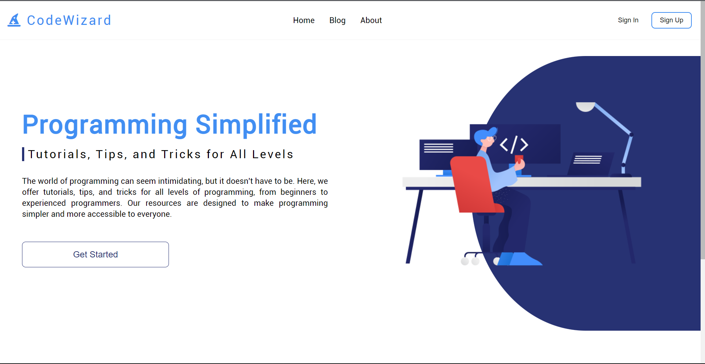

# CodeWizard

This is a programming website built with ReactJS, which aims to provide an easy and convenient way for users to access the latest news from the Tabnews platform. With the help of the Tabnews API, this website provides users with a simple way to view the latest posts in a user-friendly and modern interface.

| This is a purely educational project, with no commercial purposes.

## 🛠️ Built with

* [NPM](https://www.npmjs.com/) - Dependency Manager
* [ReactJS](https://react.dev/) - The Web Framework used

## 📌 Version

We use [Git](https://git-scm.com/) for Version Control.

## ✒️ Autors

* **Victor Vasconcelos** - *Development* - [Victorceloss](https://github.com/Victorceloss)
* **Victor Vasconcelos** - *Documentation* - [Victorceloss](https://github.com/Victorceloss)

## 📄 License

This project is licensed under (MIT) - see the [LICENSE.md](https://github.com/Victorceloss/code-wizard/blob/main/frontend/LICENSE) file for details.

---